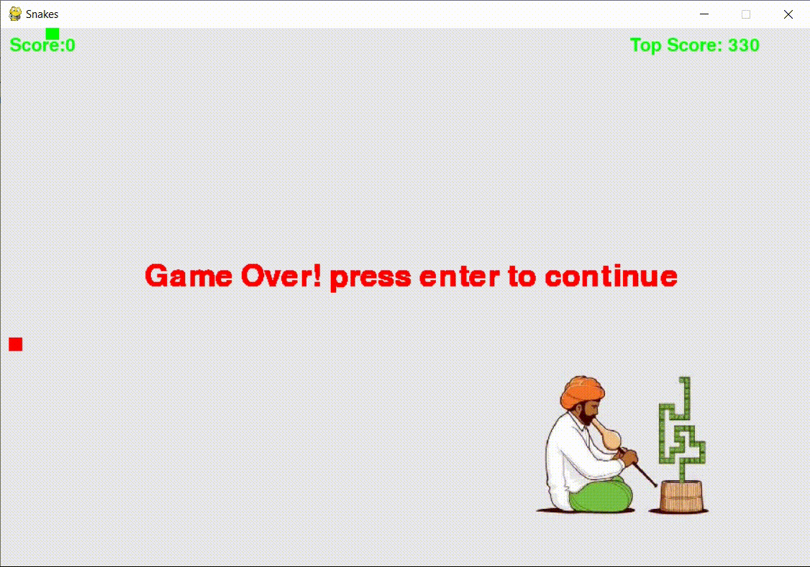

# Snake With Python

Snake With Python game with Audio Effects written in Python using Pygame library.

[]() [](https://peps.python.org/pep-0008/)  [](https://github.com/Nikhilhaspe/Alien-Invasion-Game)
## Installation

Download the Python 3 installer package from the official website and install it, if not installed previously.

Run the following in the terminal to install the Pygame library

```
pip install pygame
```

## Gameplay



## Run exe Directly
Download Alien-Invasion-Game-exe folder and dont make any changes
in that folder just run game main.exe file directly.

## Play Game Now

Play game [here](https://replit.com/@Nikhilhaspe/Snake-With-Python?v=1)

## Objective

Goal of the player is Snake has to eat as many fruits as possible.

## Mechanics

The more fruits Snake will it the more it will grow in length hance making the game
dynamic and harder.

## Controls

* Use Arrow keys to control Snake movement.
* Exit anytime from the game using `Escape` key.
## Prerequisites

- [Python](https://www.python.org/)
    
- [Pygame](https://www.pygame.org/wiki/GettingStarted)
## Acknowledgements

- [Pygame Documentation](https://www.pygame.org/docs/)

**Happy Gaming! ❤**
